# Тестування працездатності системи

Тестування сервісу проводилося за допомогою додатку Postman.

## Запуск сервера

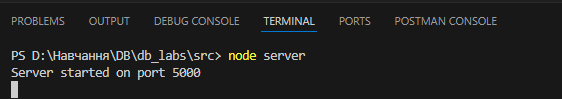

## Тестування модуля Tag

### POST /api/tag - Створення тегу

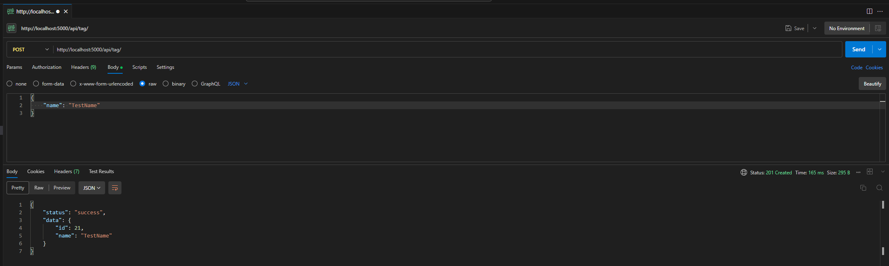

### GET /api/tag - Отримання списку всіх тегів

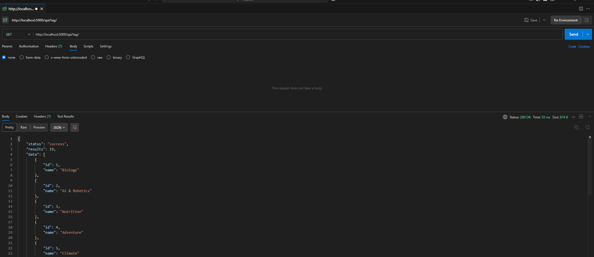

### GET /api/tag/:id - Отримання тегу за ідентифікатором

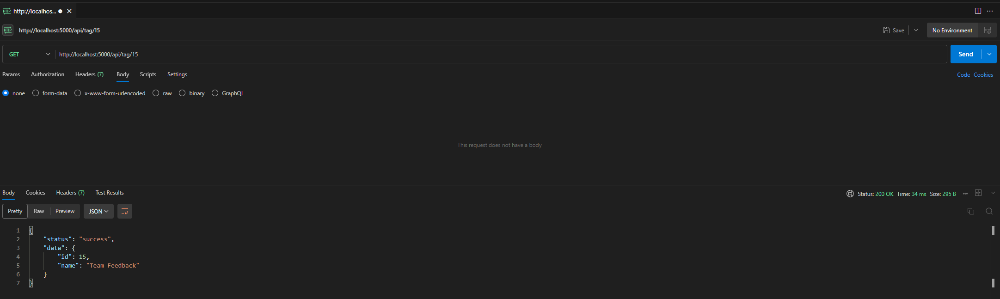

### PATCH /api/tag/:id - Оновлення інформації про тег

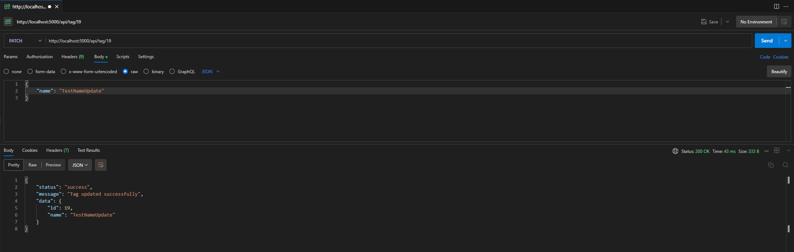

### DELETE /api/tag/:id - Видалення тегу

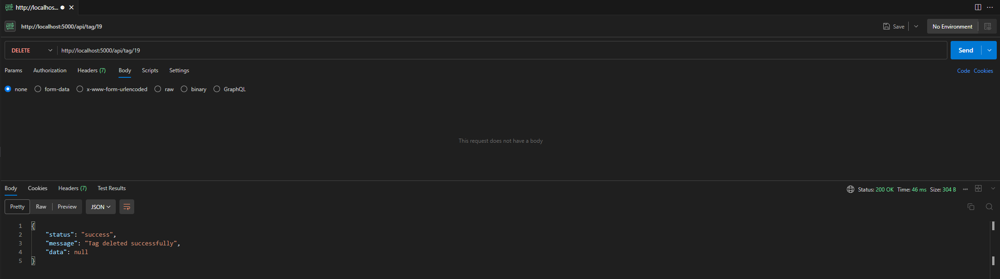

## Тестування модуля Source

### POST /api/source - Створення джерела

### GET /api/source - Отримання списку всіх джерел

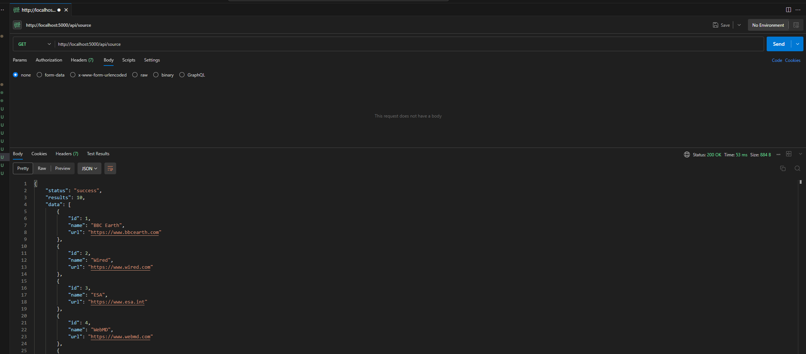

### GET /api/source/:id - Отримання джерела за ідентифікатором

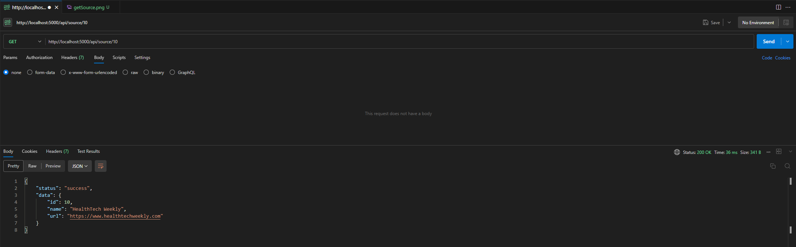

### PATCH /api/source/:id - Оновлення інформації про джерело

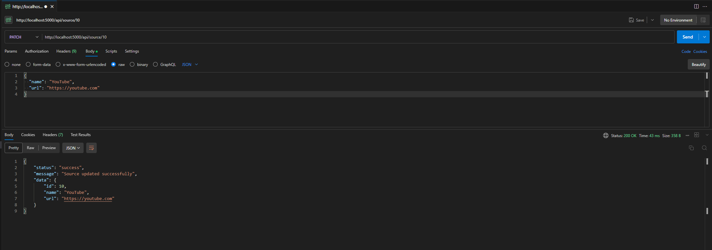

### DELETE /api/source/:id - Видалення джерела

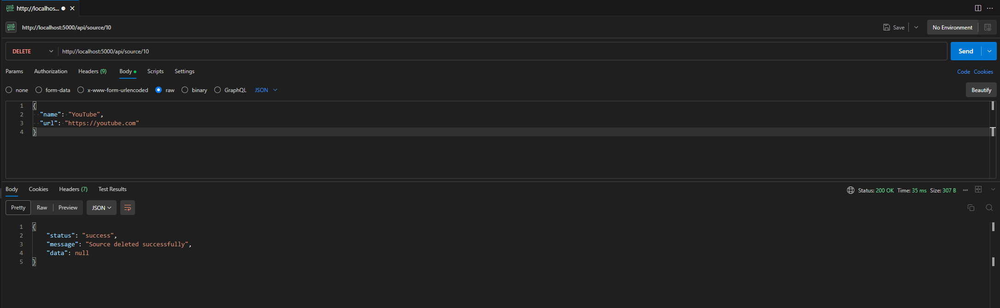

## Тестування обробки винятків

### EXCEPTION(Tag): DataMissingException (Відсутні обов'язкові дані при створенні тегу)

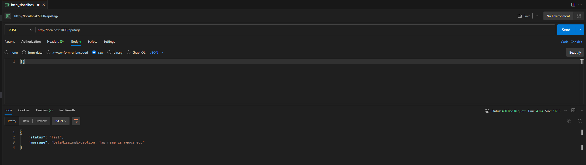

### EXCEPTION(Tag): TagNotFoundException (Тег не знайдено при запиті/оновленні)

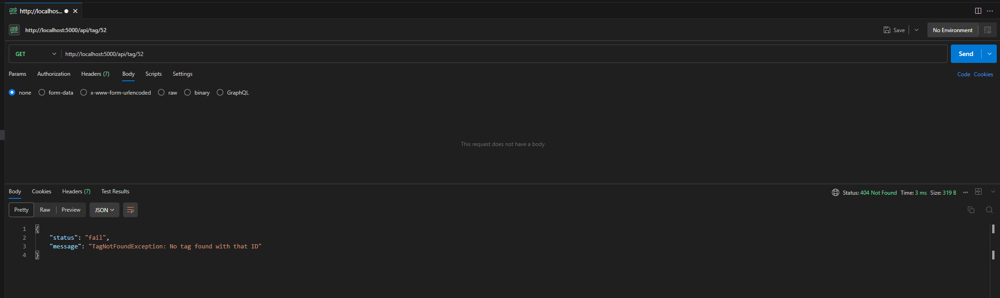

### EXCEPTION(Tag): TagNotFoundException (Тег не знайдено при оновленні)
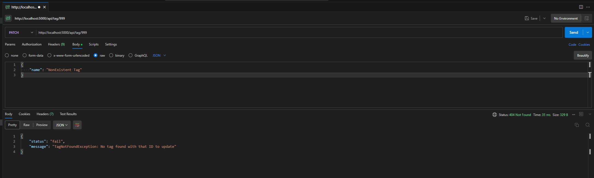

### EXCEPTION(Source): SourceNotFoundException (Джерело не знайдено при запиті/оновленні)

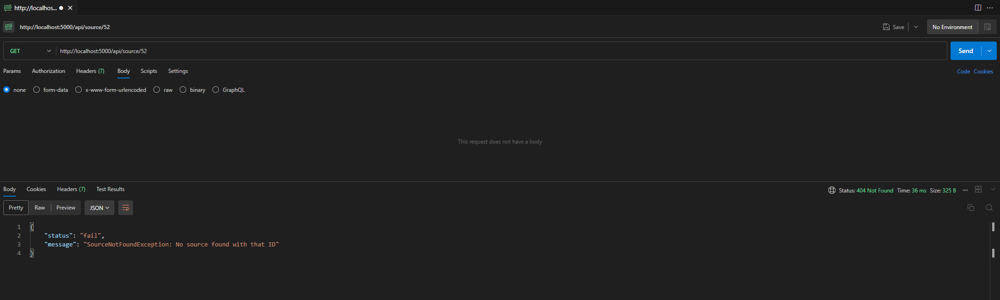

### EXCEPTION(Source): SourceNotFoundException (Джерело не знайдено при видаленні)

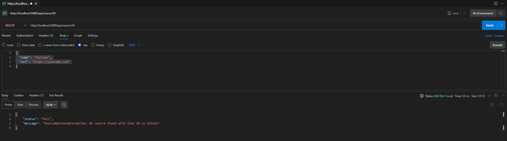