# Тестування працездатності системи

Тестування сервісу проводилося за допомогою додатку Postman.

## Запуск сервера

## POST api/user

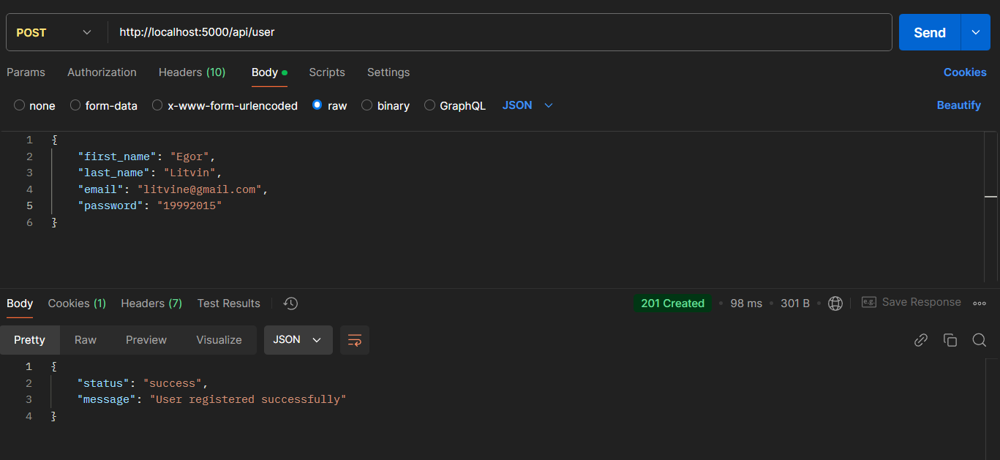

## GET api/user

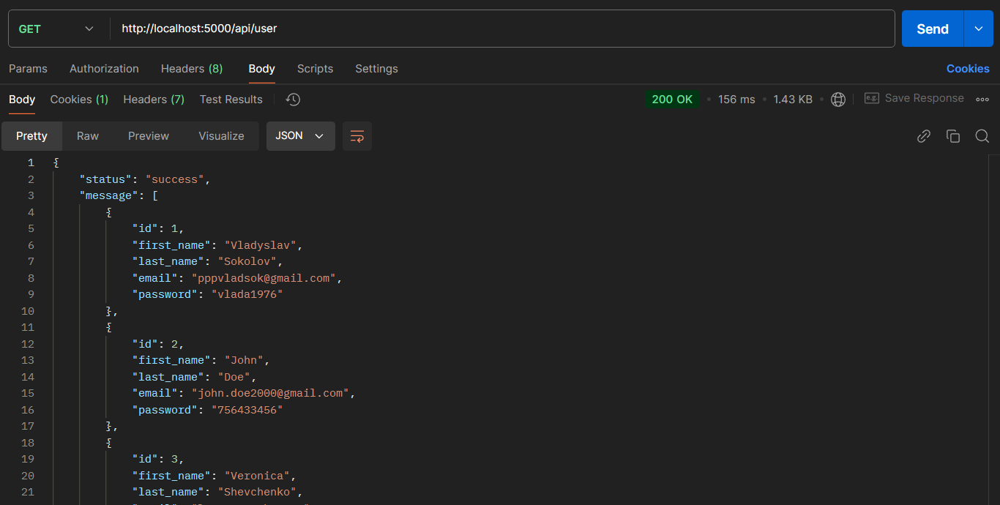

## GET api/user/:id

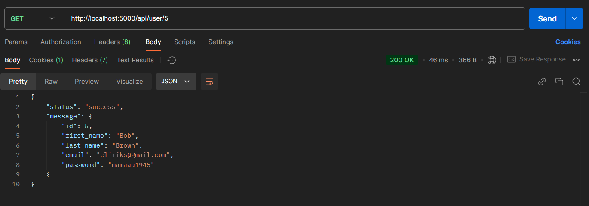

## PATCH api/user/:id

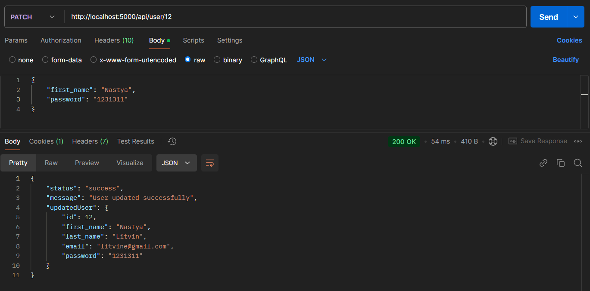

## DELETE api/user/:id

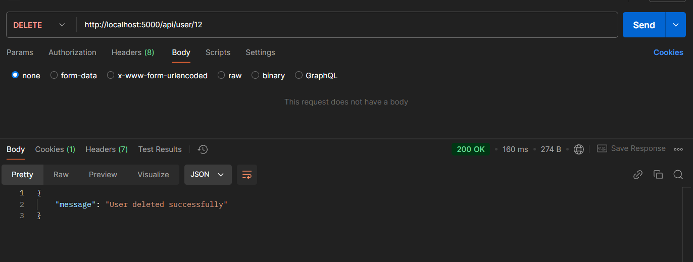

## POST api/content

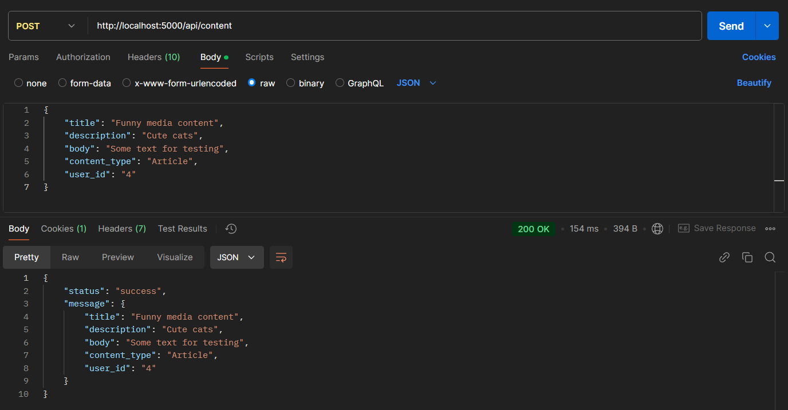

## GET api/content

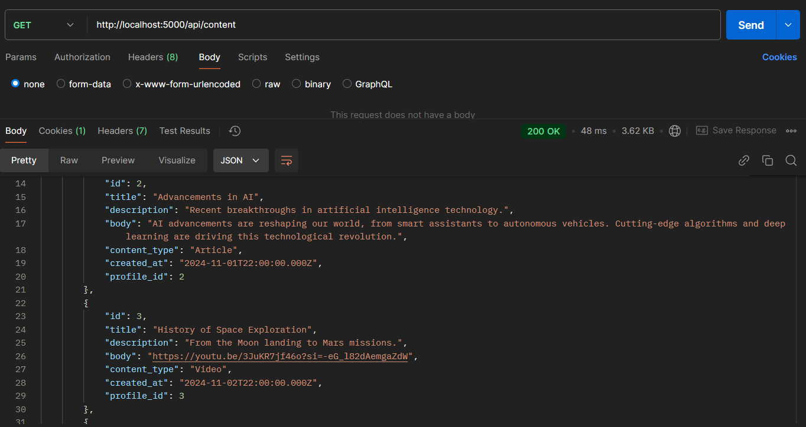

## GET api/content/:id

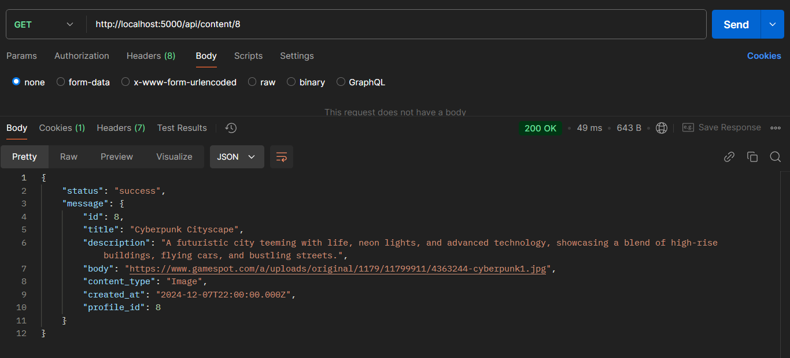

## PATCH api/content/:id

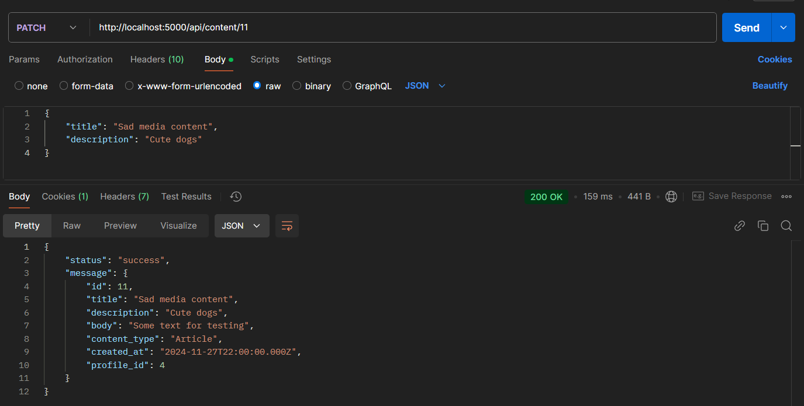

## DELETE api/content/:id

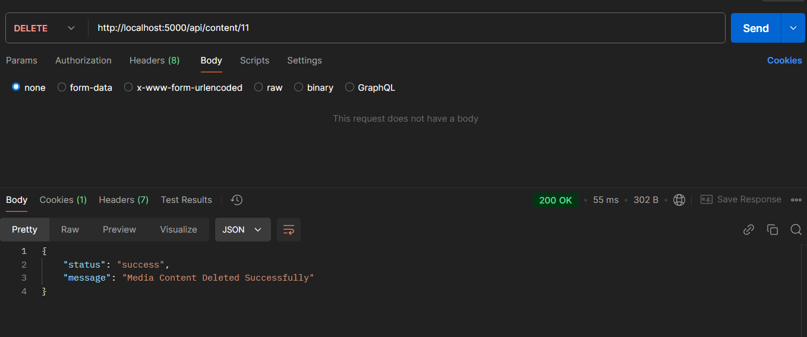

## EXCEPTION(User): DataMissingException

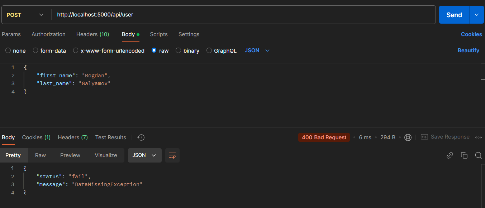

## EXCEPTION(User): AlreadyRegisteredException

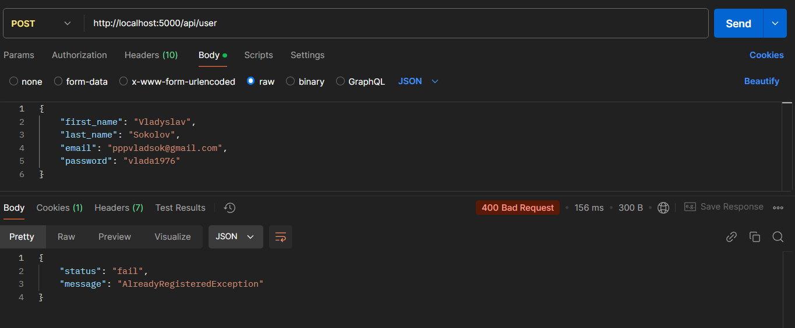

## EXCEPTION(User): UserNotFoundException

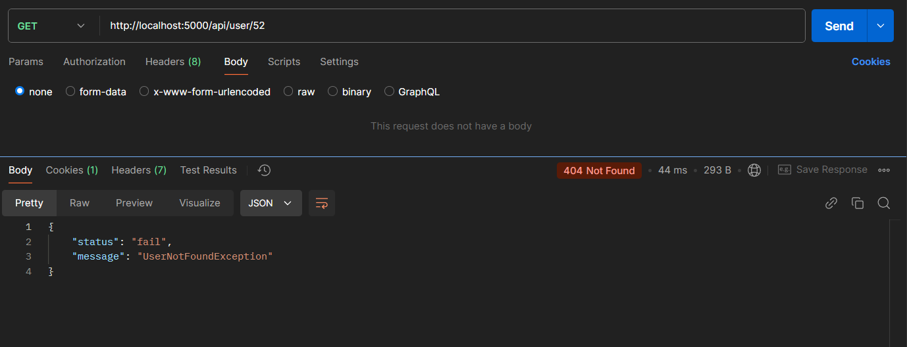

## EXCEPTION(MediaContent): RequiredFieldsMissingException

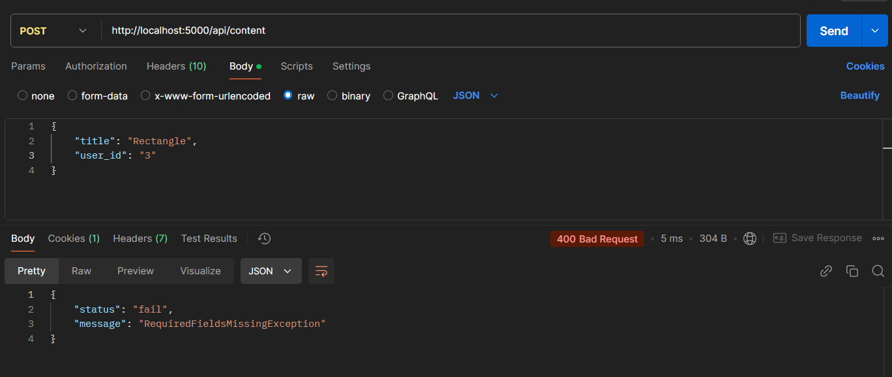

## EXCEPTION(MediaContent): MediaContentNotFoundException

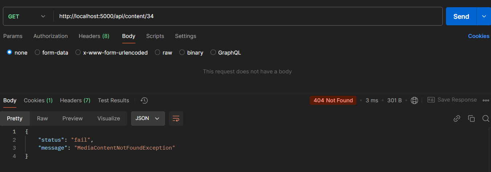